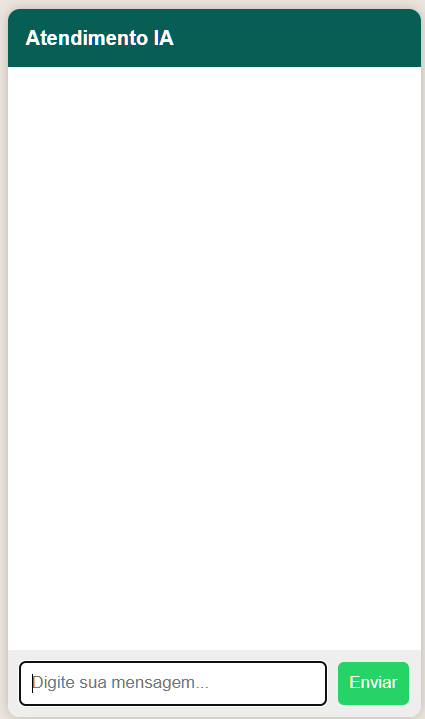

# 🤖 Chatbot IA com WhatsApp + FastAPI


---

## 🚀 Sobre o projeto

Chatbot inteligente para atendimento automatizado integrado ao **WhatsApp**, com suporte a **regras de negócio + inteligência artificial**.

Este projeto simula um sistema real de atendimento utilizado por empresas, com foco em:
- automação de suporte
- redução de tempo de resposta
- experiência conversacional natural

---

## 🔥 O que esse projeto resolve

Empresas perdem tempo respondendo:
- horários
- localização
- serviços
- dúvidas repetitivas

👉 Esse chatbot automatiza tudo isso.

---

## 📸 Preview do Sistema

<p align="center">
  
</p>

---

## 🧠 Funcionalidades

- Menu interativo com fluxo inteligente
- Controle de estado por usuário (memória de conversa)
- Atendimento automatizado com IA
- Respostas baseadas em regras
- Fallback com IA (Groq)
- Integração real com WhatsApp (Twilio)
- Interface web estilo chat
- Persistência de mensagens com SQLite

---

## 💡 Diferenciais técnicos

- Arquitetura híbrida: **Regras + IA**
- Controle de estado conversacional
- Backend desacoplado (API REST)
- Pronto para escalar para produção
- Código organizado e extensível

---

## Arquitetura do Sistema

Usuário → WhatsApp / Web
→ FastAPI
→ Regras + IA (Groq)
→ Banco de Dados
→ Resposta ao usuário

---

## Tecnologias
- Python
- FastAPI
- SQLAlchemy
- SQLite
- HTML, CSS, JavaScript
- Groq API
- Twilio API
- ngrok

---

## 📂 Estrutura do projeto

```bash
.
├── assets/
├── database.py
├── models.py
├── main.py
├── index.html
├── requirements.txt
├── README.md
└── .gitignore
```

---

## Como rodar

### 1. Clonar o projeto

```bash
git clone https://github.com/nandoalmeidam/chatbot-ia-atendimento
cd chatbot-ia-atendimento
```

### 2. Criar ambiente virtual

```bash
python -m venv .venv
```

#### Ativar ambiente

#### Windows:
```bash
.venv\Scripts\activate
```

#### Mac/Linux:
```bash
source .venv/bin/activate
```

### 3. Instalar dependências

```bash
pip install -r requirements.txt
```

### 4. Criar arquivo .env

Crie um arquivo chamado `.env` na raiz do projeto:

```env
GROQ_API_KEY=sua_chave_aqui
```

### 5. Rodar backend

```bash
uvicorn main:app --reload
```
Acesse: 
http://127.0.0.1:8000/docs

---

## Testes

### Teste via navegador

Abra o arquivo:
index.html

### Teste com Whatsapp

1. Execute o servidor
2. Rode o ngrok:
```bash
ngrok http 8000
```
3. Configure no Twilio: 

https://SEU_NGROK/whatsapp
- Método: POST

---

## Banco de dados

O sistema utiliza SQLite com SQLAlchemy.

As mensagens dos usuários são armazenadas automaticamente, permitindo:

- histórico de conversa
- análise futura
- evolução do atendimento

## Exemplo de uso:

Usuário: oi
Bot: mostra menu

Usuário: 1
Bot: entra em atendimento

Usuário: localização
Bot: pergunta confirmação

Usuário: sim
Bot: envia Google Maps

📌 Próximos passos

Dashboard administrativo
Deploy em cloud (AWS / Railway)
Banco PostgreSQL em produção
Autenticação
Analytics de conversas

Autor

Fernando Almeida
Desenvolvedor Back-End focado em APIs, automação e IA aplicada a negócios


💼 Sobre o projeto

Este projeto pode ser adaptado para:

- SAC automatizado
- atendimento comercial
- suporte técnico
- assistentes virtuais empresariais